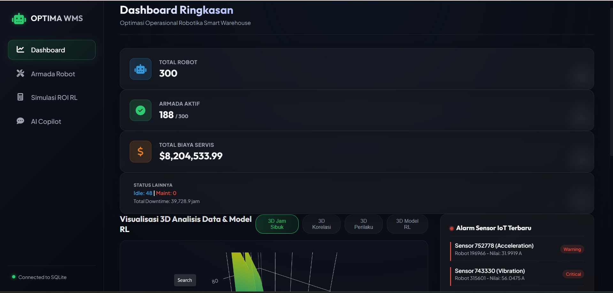
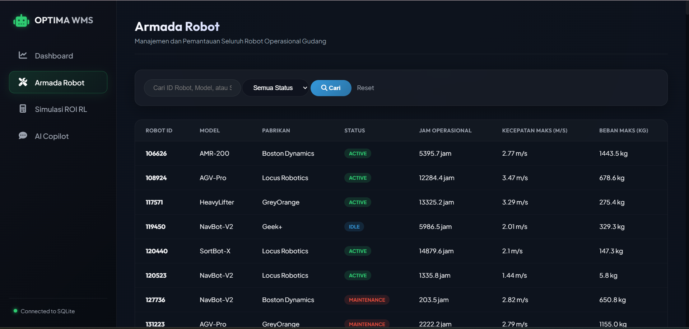
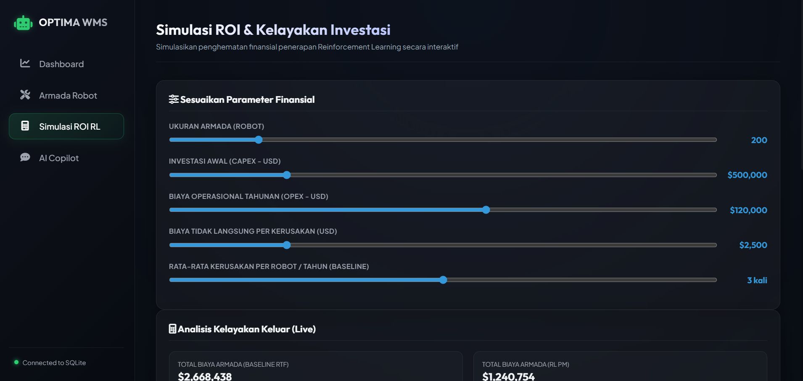
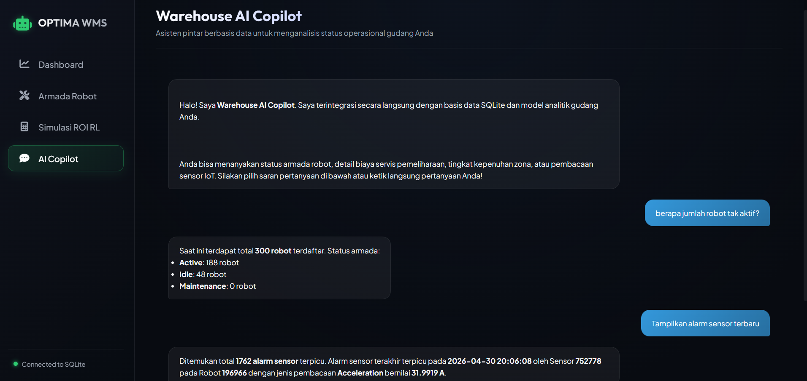

# OptiWare MARL: Intelligent Robot Optimization Platform

OptiWare MARL is a state-of-the-art intelligent analytics and business simulation platform driven by Multi-Agent Reinforcement Learning (MARL). It is designed to optimize the operation, routing, and predictive maintenance of autonomous robot fleets within a Smart Warehouse ecosystem.

This end-to-end data science project covers data cleaning, exploratory data analysis (EDA), custom Gymnasium-based Reinforcement Learning (RL) modeling for maintenance scheduling, financial ROI business simulations, and an interactive Django-based web portal.

---

## 📌 Core Problems Solved

1. **Data Silos and Referencing Inconsistencies (Disjoint Keys)**
   - **Problem**: Before preprocessing, the 10 raw tables across 5 operational modules suffered from disconnected databases. This resulted in a **0% match rate** for keys (`robot_id` and `zone_id`) between operational fact tables (maintenance, tasks, inventory, and sensor logs) and master dimensions.
   - **Solution**: Developed a deterministic modulo-based alignment strategy to map disjoint IDs 1-to-1 back to the master keys, achieving a **100% key match rate** for data join integrity.

2. **Inactive IoT Sensor Alert Logic**
   - **Problem**: The IoT sensor database (`ds5_sensor_readings_fact.csv`) had its `alert_triggered` column set to `0` for all 10,000 records, completely failing to register alarms despite multiple warning/critical logs in the metadata.
   - **Solution**: Refactored the alert logic by syncing `alert_triggered = 1` whenever `alert_level` registered a value (`Info`, `Warning`, or `Critical`). This correction revealed that **34.93%** of sensor records had active alerts.

3. **Inefficient Run-To-Failure (RTF) Maintenance**
   - **Problem**: Reactive maintenance policies caused frequent unexpected mechanical breakdowns (averaging **2 breakdowns per robot annually**), incurring direct repair costs and causing expensive warehouse floor blockages.
   - **Solution**: Modeled a custom Gymnasium environment utilizing a **Weibull distribution** to simulate degradation wear-out phases, allowing the RL agent to schedule optimal preventive actions.

4. **Warehouse Traffic Congestion**
   - **Problem**: Poor task allocation and uncoordinated paths caused bottlenecking in high-traffic warehouse staging zones.
   - **Solution**: Utilized spatial-temporal activity analysis to guide routing adjustments based on load parameters and local zone densities.

---

## 🧹 Data Cleaning & Preprocessing

The preprocessing pipeline in [01_Data_Cleaning_Preprocessing.ipynb](file:///c:/Users/hpvic/OneDrive/Documents/OptiWare-MARL--Intelligent-Robot-Optimization-Platform/01_Data_Cleaning_Preprocessing.ipynb) implements the following steps:
- **Key Mapping**: Sorted unique IDs in fact tables and deterministically mapped them to the 300 master `robot_id`s and 80 master `zone_id`s.
- **Alert Synchronization**: Mapped `alert_triggered` flags to boolean representations of active warning and critical alert levels.
- **SQLite Database Seeding**: Exported all tables to clean CSV files in the `cleaned_data/` directory and designed a custom Django database management command (`load_cleaned_data`) to programmatically seed the SQLite database.

---

## 📈 Analysis Process & Jupyter Pipelines

The data science lifecycle is modeled chronologically through four Jupyter Notebooks:

1. **[01_Data_Cleaning_Preprocessing.ipynb](file:///c:/Users/hpvic/OneDrive/Documents/OptiWare-MARL--Intelligent-Robot-Optimization-Platform/01_Data_Cleaning_Preprocessing.ipynb)**
   - Cleans the raw data silos, repairs the disjoint database schemas, corrects sensor alert flags, and exports clean tables.
2. **[02_Exploratory_Data_Analysis.ipynb](file:///c:/Users/hpvic/OneDrive/Documents/OptiWare-MARL--Intelligent-Robot-Optimization-Platform/02_Exploratory_Data_Analysis.ipynb)**
   - Identifies patterns in task traffic, technician capabilities, and battery/environmental physics to construct state spaces, action spaces, and reward formulas for RL.
3. **[03_RL_Modeling_Maintenance.ipynb](file:///c:/Users/hpvic/OneDrive/Documents/OptiWare-MARL--Intelligent-Robot-Optimization-Platform/03_RL_Modeling_Maintenance.ipynb)**
   - Builds a custom predictive maintenance simulator using Gymnasium. Trains a **Tabular Q-Learning** agent to schedule preventive maintenance.
4. **[04_Business_ROI_Simulation.ipynb](file:///c:/Users/hpvic/OneDrive/Documents/OptiWare-MARL--Intelligent-Robot-Optimization-Platform/04_Business_ROI_Simulation.ipynb)**
   - Conducts a 3-year cash flow projection for a 300-robot fleet, computing CapEx, OpEx, Net Present Value (NPV), Internal Rate of Return (IRR), and Payback Period.

---

## 💡 Key Insights Discovered

- **Spatial-Temporal Traffic Bottlenecks**: Warehouse congestion peaks during clear rush hours: **08:00 AM - 10:00 AM** and **04:00 PM - 06:00 PM**. Staging and pickup zones are major hotspots.
- **Technician Skill Impact**: Highly certified "Master Techs" have a **98% inspection pass rate** compared to "Level-1" technicians (75% pass rate), drastically lowering recurring downtime.
- **Battery & Environmental Physics**: Payload weights exhibit an exponential relationship with battery drainage rates. High ambient temperatures ($>30^{\circ}\text{C}$) directly correlate with a surge in robot collisions, requiring speed limits to be reduced during heat spikes.
- **Optimal RL Scheduling Policy**: The trained Q-learning agent successfully learned a policy of scheduling preventive maintenance using Master Techs on specific days (days **85, 199, and 284**), reducing the annual fleet breakdown count to **0**.
- **Financial Viability**: Extrapolating RL policies across 300 robots proves highly profitable:
  - **$1.39M USD** in annual operational savings.
  - Payback period of only **4.5 months** to recover the initial **$500,000 USD CapEx**.
  - **704.9% 3-Year ROI** and a Net Present Value (NPV @10%) of **$2.84M USD** with an IRR of **262.7%**.

---

## 🌟 Django Web Portal Features

### 1. Operations Overview Dashboard
Provides a holistic view of the fleet, tracking total registered robots, active robots on the floor, and total maintenance expenditures. Incorporates real-time IoT alerts and interactive 3D visualizations.

### 2. Robot Fleet Management
A detailed tracking matrix enabling warehouse managers to query operational states (Active, Idle, Maintenance), flight hours, speed ceilings, and maximum payload capacities.

### 3. Interactive ROI & Investment Simulator
A real-time investment calculator that simulates financial outcomes based on custom configurations (fleet size, CapEx, annual software OpEx, and indirect breakdown costs) to instantly display NPV, IRR, and payback metrics.

### 4. Warehouse AI Copilot
An integrated conversational AI assistant (chatbot) utilizing Django backend utilities to answer natural language operational inquiries (e.g., *"how many robots are currently in maintenance?"* or *"list critical alerts"*) directly from the SQLite database.

---

## 📂 Directory Structure

```text
├── cleaned_data/              # Preprocessed, aligned datasets (.csv)
├── docs/                      # Project documents, diagrams, and plots
├── warehouse_portal/          # Primary Django project configurations
├── dashboard/                 # Main Django web app (models, views, templates)
│   ├── management/commands/   # Custom data seeding management commands
│   ├── static/                # Static assets, styling, and images
│   └── templates/             # HTML templates (Dashboard, ROI, AI Copilot)
├── 01_Data_Cleaning_Preprocessing.ipynb  # Data cleaning pipeline
├── 02_Exploratory_Data_Analysis.ipynb     # Exploratory Analysis
├── 03_RL_Modeling_Maintenance.ipynb      # RL Environment & Agent Training
├── 04_Business_ROI_Simulation.ipynb      # Business & Financial Modeling
├── .gitignore                 # Git ignored files
├── requirements.txt           # Python library dependencies
└── README.md                  # Project documentation (this file)
```

---

## 🚀 Step-by-Step Execution Guide

### 1. Environment Setup & Dependency Installation
Create a Python virtual environment and install the required libraries:
```bash
python -m venv venv
venv\Scripts\activate
pip install -r requirements.txt
```

### 2. Database Migrations
Set up your local SQLite database schemas:
```bash
python manage.py makemigrations
python manage.py migrate
```

### 3. Database Seeding
Populate the SQLite database tables using the preprocessed data:
```bash
python manage.py load_cleaned_data
```

### 4. Run the Local Web Server
Start the Django development server:
```bash
python manage.py runserver
```
Once the server is running, access the web portal at:
👉 **[http://127.0.0.1:8000/](http://127.0.0.1:8000/)**

## Dashboards Show

### Dashboard Ringkasan


### Dashboard Armada Robot


### ROI Simulation


### Warehouse AI Copilot
