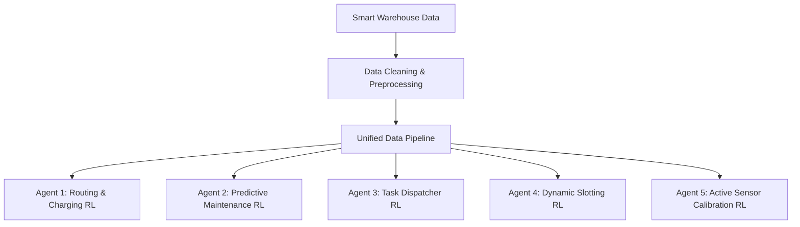

# PROJECT PROPOSAL: WAREHOUSE ROBOT OPERATIONS OPTIMIZATION
## Multi-Agent Reinforcement Learning & Data Science Portfolio Project

---

## 1. Executive Summary
Proyek ini bertujuan untuk mengoptimalkan operasional gudang pintar (Smart Warehouse) berbasis robotika menggunakan pendekatan **Data Science** dan **Reinforcement Learning (RL)**. Dengan memanfaatkan data historis dari lima pilar utama operasional—operasi robot, log pemeliharaan, penugasan kerja, pergerakan inventaris, dan pembacaan sensor IoT—kita akan melatih beberapa agen cerdas untuk meminimalkan kegagalan tugas, menekan biaya pemeliharaan, mengoptimalkan tata letak barang (slotting), serta meminimalkan downtime dan tabrakan robot.

---

## 2. Arsitektur & Kualitas Data (Data Audit)
Sebelum pemodelan dilakukan, audit data mendalam menunjukkan adanya beberapa tantangan kualitas data berupa ketidaksesuaian ID antar-silo data (disjoint keys). 

### Temuan Kunci Audit Data:
1. **Disjoint Robot IDs**: Modul `ds2` (Maintenance), `ds3` (Tasks), `ds4` (Inventory), dan `ds5` (Sensors) menggunakan ID robot yang terpisah dan tidak saling beririsan dengan `ds1_robots_dim.csv`.
2. **Disjoint Zone IDs**: ID zona dalam log operasi (`ds1`) dan pembacaan sensor (`ds5`) tidak cocok dengan dimensi zona gudang (`ds3_warehouse_zones_dim`).
3. **Sensor Alert Bug**: `alert_triggered` bernilai `0` untuk seluruh baris, padahal kolom `alert_level` mencatat status `Warning` dan `Critical`.

### Strategi Penyelesaian (Data Preprocessing):
* **Penyelarasan Master Robot ID**: Memetakan ID robot yang terpisah di setiap tabel ke Master Robot ID di `ds1_robots_dim` secara deterministik untuk menciptakan riwayat siklus hidup robot yang utuh (Operations + Tasks + Maintenance + Sensor).
* **Harmonisasi Zona Gudang**: Memetakan `zone_id` dari seluruh tabel ke dalam 80 zona master di `ds3_warehouse_zones_dim`.
* **Koreksi Logika Alarm**: Memperbaiki indikator `alert_triggered` berdasarkan nilai `alert_level` yang tidak kosong.

---

## 3. Formulasi Multi-Agent Reinforcement Learning
Kita akan membagi optimasi operasional gudang ke dalam **5 Agen Reinforcement Learning** yang berfokus pada ranah bisnis:

### Opsi 1: Routing & Battery Management Agent (Modul DS1)
* **Masalah Bisnis**: 12.1% kegagalan operasi dan 15.4% kejadian tabrakan robot.
* **Formulasi RL**:
  * **State ($S$)**: Model robot, tingkat baterai saat ini, berat beban, suhu sekitar, tingkat kelembapan, koordinat posisi, dan riwayat tabrakan.
  * **Action ($A$)**: Penyesuaian batas kecepatan kecepatan, penentuan rute jalan, dan keputusan pengisian daya (*charge* vs *continue*).
  * **Reward ($R$)**: $+10$ untuk keberhasilan tugas, $-50$ untuk setiap tabrakan, $-20$ jika baterai drop di bawah batas aman.

### Opsi 2: Predictive Maintenance Scheduler Agent (Modul DS2)
* **Masalah Bisnis**: 21.8% kegagalan inspeksi pasca-perbaikan, rata-rata downtime 4 jam, dan frekuensi perbaikan berulang tinggi (rata-rata 3.48 kali).
* **Formulasi RL**:
  * **State ($S$)**: Total jam operasional robot, usia baterai, riwayat kode kesalahan (`fault_code`), ketersediaan teknisi, dan tingkat sertifikasi teknisi.
  * **Action ($A$)**: Penjadwalan tanggal servis preventif dan pencocokan otomatis antara tingkat kesulitan kerusakan dengan sertifikasi teknisi (*Master Tech* vs *Level-1*).
  * **Reward ($R$)**: Meminimalkan downtime, menekan pengeluaran suku cadang (`parts_cost_usd`), dan memberikan penalti jika inspeksi pasca-perbaikan gagal (`inspection_passed = 0`).

### Opsi 3: Dynamic Task Dispatcher Agent (Modul DS3)
* **Masalah Bisnis**: 11.9% error rate pada penugasan dan tingginya biaya re-assignment tugas akibat robot tidak efisien.
* **Formulasi RL**:
  * **State ($S$)**: Antrean tugas aktif (jenis tugas, bobot, lokasi rak), status robot (baterai, tipe robot, kapasitas muat maksimum).
  * **Action ($A$)**: Penunjukan kecocokan robot-ke-tugas secara real-time.
  * **Reward ($R$)**: Memaksimalkan skor efisiensi tugas, meminimalkan durasi penyelesaian, dan meminimalkan kegagalan tugas.

### Opsi 4: Dynamic Inventory Slotting Agent (Modul DS4)
* **Masalah Bisnis**: Kerusakan produk sebesar 7.7% dan inefisiensi waktu pemindahan barang (rata-rata 59 menit per perpindahan).
* **Formulasi RL**:
  * **State ($S$)**: Peta keterisian rak, sensitivitas suhu barang, shelf-life barang, dan frekuensi permintaan barang (fast vs slow-moving).
  * **Action ($A$)**: Rekomendasi penempatan rak penyimpanan (`to_rack`) untuk barang masuk.
  * **Reward ($R$)**: Meminimalkan durasi perpindahan, memaksimalkan utilisasi kapasitas, dan mencegah kerusakan barang akibat salah penempatan suhu.

### Opsi 5: Active Sensor Calibration Agent (Modul DS5)
* **Masalah Bisnis**: Tingginya status pembacaan sensor bermasalah (ERR/TIMEOUT/WARN) yang mencapai ~60% dari total log.
* **Formulasi RL**:
  * **State ($S$)**: Riwayat log sensor, tingkat deviasi kalibrasi, signal strength (dBm), dan persentase packet loss.
  * **Action ($A$)**: Perintah kalibrasi ulang mandiri, penyesuaian sampling rate, atau pengiriman instruksi servis fisik.
  * **Reward ($R$)**: Meminimalkan tingkat packet loss, menjaga kalibrasi offset mendekati nol, dan menekan kegagalan transmisi data.

---

## 4. Rencana Kerja & Roadmap Proyek
1. **Tahap 1: Data Cleaning & Preprocessing (Jupyter Notebook `01_Data_Cleaning_Preprocessing.ipynb`)**
   * Penanganan disjoint key (`robot_id`, `zone_id`).
   * Konsistensi tipe data, handling null, dan perbaikan logika sensor alert.
   * Ekspor hasil bersih ke folder `cleaned_data/`.
2. **Tahap 2: Exploratory Data Analysis (Jupyter Notebook `02_Exploratory_Data_Analysis.ipynb`)**
   * Visualisasi interaktif tren kemacetan zona, jam sibuk (peak hours), analisis korelasi downtime, dll.
3. **Tahap 3: Reinforcement Learning Modeling (Jupyter Notebook `03_RL_Modeling_Maintenance.ipynb` & `03_RL_Modeling_Routing.ipynb`)**
   * Pembuatan Environment berbasis `Gymnasium`.
   * Implementasi algoritma RL (seperti Q-Learning, DQN, atau PPO menggunakan `Stable-Baselines3`).
4. **Tahap 4: ROI & Business Simulation (Jupyter Notebook `04_Business_ROI_Simulation.ipynb`)**
   * Simulasi keuangan untuk membandingkan skenario sebelum vs sesudah penerapan model RL.
   * Perhitungan estimasi penghematan biaya operasional gudang.
